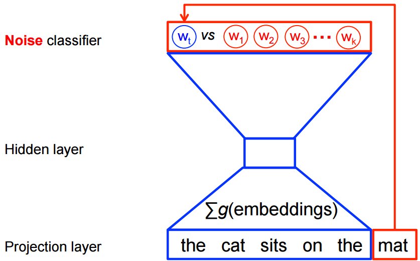

This is a document that details the analysis of text collected for the purpose of answering the question of how people engage with their purchases. In particular, what is unique about those materialistic purchases that make us happy? In this document, you'll see most of the code that generates the data. Some of the work was done in python, and I've excluded some of that here, though I've embedded some for expository purposes. This document was written primarily to communicate my analyses to the rest of the research team. 

```{r load_libs, echo=FALSE, message=FALSE}
library(haven)
library(knitr)
library(dplyr)
library(ggplot2)
library(magrittr)
library(forcats)
library(stm)
library(rstanarm)
library(bayesplot)
```

```{r table1}
df <- read_sav('../data/MCH.sav')
df$Cond <- factor(df$Cond, levels=c('A', 'B', 'C'), labels=c('Low', 'Medium', 'High'))
df %>% 
  filter(!is.na(Attention_Check)) %>%
  group_by(Cond, Attention_Check) %>%
  summarise(number = n()) -> tab
kable(tab, caption = "Number of participants by condition")
```

It looks like people recalling happy purchases were less likely to fail the attention check. Writing about positive purchases makes for more engaged participants, maybe?

```{r fig1, fig.cap = 'Distribution of purchase categories as a function of condition', message=FALSE}
df %<>% filter(`filter_$`==1)
df$Mat_Type1 <- as_factor(df$Mat_Type1)
df %>%
  group_by(Mat_Type1) %>%
  summarise(number_purchases = n()) %>%
  left_join(df) -> df
df %>%
  group_by(Mat_Type1, Cond) %>%
  mutate(number=n()) %>%
  arrange(number_purchases) %>%
  ungroup() %>%
  mutate(Mat_Type1 = fct_reorder(Mat_Type1, number_purchases)) %>%
ggplot(aes(x=Mat_Type1, group=Cond, fill=Cond)) + 
  geom_bar(position = position_dodge()) +
  theme_classic() +
  theme(axis.text.x = element_text(angle=45, hjust=1),
        axis.title.x = element_blank(),
        legend.title = element_blank())
  
```

Looking at the distribution of purchase categories, I think it's pretty clear that people in general were more likely to list either electronics or clothing. Some other informal observations are that it looks like vehicles are killjoy purchases, kitchen appliances elicit a 'meh', jewelry makes people pretty happy, and it's kind of tough to be upset about buying sporting goods. 

To model the actual text, I'm going to use a variant of a topic model. Topic models are generative statistical models that make assumptions about how a collection of text documents were generated, and then use the observed text to infer the parameters within the statistical model. In general, a topic model consists of words, topics (defined as mixtures of words, where each word has some probability of belonging to the topic), and documents (defined as mixtures of topics, where any given topic has its probability mass distributed across all documents, and the topic probabilities across all documents sums to one).

STM is a variant of the vanilla topic model described above that allows incorporating of meta-information into this generative process. We can specify that the *quantity* of documents that are associated with a topic are dependent upon the metadata (topic prevalence), or we can specify that the *content* of topics are dependent upon the metadata (topic content).

```{r preprocess}
library(stm)
processed <- textProcessor(df$Mat_Essay1, metadata=df)
out <- prepDocuments(processed$documents, processed$vocab, processed$meta)
docs <- out$documents
vocab <- out$vocab
meta <- out$meta
```

Above, we see that the raw corpus has about 45k words. Of these 45k words, we perform some preprocessing to obtain 4,743 unique terms. As seen above, we remove punctuation, numbers, and perform stemming (i.e. convert *running*, *runs*, *runner* all into *run*). Additionally, "stopwords" (e.g. pronouns, determiners, etc) are removed. Although Pennebaker et al. have found that many function words (e.g. pronouns) seem to carry psychological information, here we are more interested in the *content*, and so these common words are removed. Additionally, stripping stop words helps ease the computational load of representing and generating these types of models (though for this particular case, that is not a strong concern). Additionally, all words that occur just once are removed. After this process, we are left with 2,516 distinct terms.

## Topical Prevalence
First, we explore how the condition changes the prevalence of topics across documents, *keeping the content of the topics constant*. Ordinarily, we need to specify how many topics should be fit with a topic model. However, given that we have no *a-priori* reason to pick one value over another, and there is little previous work done using these models for psychological questions, we can take a data-driven approach to evaluate how to pick the number of topics.

There are many metrics one can use to evaluate a topic model. Here, we'll focus on two - the ability of the model to predict new data (held-out likelihood), and the degree to which high probability words are likely to appear in other topics (Exclusivity). For both of these metrics, higher values are better. I fit topic models using $K$ topics where $K=(3, 4, ... 20)$, and show the results of these analysis using both of the held-out likelihood and exclusivity below.


```{r fig2, fig.cap="Held-out Likelihood as a function of the number of topics"}
set.seed(42)
# Most models are commented out to reduce document compilation time
#prev_fit <- searchK(out$documents, vocab=out$vocab, K=seq(3, 20, by =1), 
                    #prevalence=~Cond, max.em.its = 200, data=out$meta, 
                    #init.type='Spectral')
#save(prev_fit, file='../output/topic_selection.rdata')
load('../output/topic_selection.rdata')
ggplot(prev_fit$results, aes(x=K, y=heldout)) + 
  geom_line() + 
  theme_classic() +
  ylab('Held-out Likelihood')
```


```{r fig3, fig.cap="Exclusivity as a function of the number of topics"}
ggplot(prev_fit$results, aes(x=K, y=exclus)) + 
  geom_line() + 
  theme_classic() +
  ylab('Exclusivity')
```


Note that because of the stotastic nature of this work, changing the value of the random seed may yield slightly different results. Regardless, this analysis suggests around a dozen topics is an ideal point. Held-out likelihood maximizes at k=12 (`r round(prev_fit$results$heldout[12], 2)`), while exclusivity begins to plateau at around K=14 (`r round(prev_fit$results$exclus[14], 2)`). This can be seen in Figures 2 and 3. After some discussion among my collaborators in which we manually examined the topics for coherence, we settled on a model with 15 topics. This is estimated below.

```{r, results='hide'}
# k15 <- stm(out$documents, vocab=out$vocab, K=15, prevalence=~Cond,
#                 max.em.its = 200, data=out$meta, init.type='Spectral')
# save(k15, file='../output/k15.rdata')
load('../output/k15.rdata')
```

After estimating this model, one of the first things to do is look at the word-topic distributions. The STM package provides several methods for examining the "top words" in a topic, and the next code chunk gives one of the most basic ways of examining these relationships - the top words for each topic. The idea of a "top" word can be operationalized in a number of ways. Here, we have four different metrics. `Prob` simply outputs the words that have the highest probability weights in that topic. While straightforward, this has the disadvantage of favoring words that are more common in the corpus. `FREX` weights words by their frequency and how exclusive they are to the topic. `Lift` is similar in that it weights words by how frequently they appear in other topics. `Score` divides the log frequency of the word in the topic by the log frequency of the word in other topics.

```{r}
labelTopics(k15)
```

This illustrates that the estimated topics map reasonably well to many of the purchase categories, though some (e.g. electronics) appear to have split into more than one topic (topic 13, 12, 9).

Let's look at some documents that are strongly associated with specific topics. I'm looking at 15 because I kind of love the essay. I leave it here without comment.

```{r}
findThoughts(k15, texts=df$Mat_Essay1, n=1, topics = 15)
```


This topic appears to be about furniture. This *particular* piece of furniture is a set of dog steps, but I suppose even dogs need furniture...(?).

Anyway, let's examine some other details of the model. Figure 4 below details the overall proportion of all essays that are composed of each of the 15 topics.

```{r fig4, fig.cap='Proportion of total corpus about each topic'}
plot(k15, type='summary', labeltype='frex')
```

Recall that when we looked at the categories chosen as indicated by individuals, clothing and electronics dominated. This is reflected here, where 6 of the 8 top topics come from these two prominent categories (note: the words here are chosen based on their FREX score).

```{r, fig5, fig.cap='Effect of condition on the prevalence of topic 10'}
prep <- estimateEffect(1:15 ~ Cond, k15, meta=out$meta, uncertainty='Global')
plot(prep, covariate='Cond', topics=10, main='Topic 10: shoe, jean, pair', 
     labeltype='custom', custom.labels=c('Low', 'Medium', 'High'))

```

Figure 5 shows the relationship between topic 10 and condition. On the x axis is estimated topic proportion, and the bars represent 95% confidence intervals. There does not appear to be a systematic relationship between condition and propensity to write about this particular topic. However, other topics do show some systematic relationship. For instance, topic 14 appears to be a topic that is, to some extent, actually devoted to the "medium" condition. This effect is plotted in figure 6, and is reinforced when looking at the top two essays from this topic

```{r, fig6, fig.cap='Effect of condition on prevalence of topic 14'}
plot(prep, covariate='Cond', topics=14, main='Topic 14: Scale, Moder, Happy', 
     labeltype='custom', custom.labels=c('Low', 'Medium', 'High'))
```

```{r}
print(findThoughts(k15, texts=df$Mat_Essay1, n=2, topic=14))
```


I also observe a difference in topic 15:

```{r, fig7, fig.cap = "Effect of condition on prevalence of topic 15"}
plot(prep, covariate='Cond', topics=15, main='Topic 15: matress, bed, couch', 
     labeltype='custom', custom.labels=c('Low', 'Medium', 'High'))
```

```{r}
print(findThoughts(k15, texts=df$Mat_Essay1, n=2, topic=15))
```

It is evident that this particular form of analysis tends to pick up on the popularity of writing about various purchase *types* as a function of condition. While this maps well to intuition (it would be odd if a statistical model did *not* pick up on these types of content differences), they hold little theoretical interest. Consequently, a slightly different modeling approach is in order. We can allow topical content to vary by condition in addition to allowing topic prevalency to vary by condition. This should allow, in principle, for us to state, for instance, that individuals in condition X wrote about their purchases in a way that is different from those in condition Y. This model is fit below:

```{r}
#k15.content.noint <- stm(out$documents, out$vocab, K=15, prevalence=~Cond,
#                   content=~Cond, max.em.its = 75,
#                   data=out$meta, interactions = F, init.type='Spectral')
#save(k15.content.noint, file='../output/k15_content_noint.rdata')
load('../output/k15_content_noint.rdata')
#Not interested in the interactions
#k15.content. <- stm(out$documents, out$vocab, K=15, prevalence=~Cond,
#                   content=~Cond, max.em.its = 75,
#                   data=out$meta, init.type='Spectral')
#This pulls out the covariate-specific word deflections
#dat <- data.frame(words = k15.content.noint$vocab,
#                  low = k15.content.noint$beta$kappa$params$`16`,
#                  med = k15.content.noint$beta$kappa$params$`17`,
#                  high = k15.content.noint$beta$kappa$params$`18`)
#write.csv(dat, '../word_topic_deflections.csv', row.names = F)
dat <- read.csv('../output/word_topic_deflections.csv')

summary(k15.content.noint)

```

The output displayed above shows:

1. The overall topic words.
2. The words that most distinguish low, medium, and high happiness.

It is the latter part of the output that we are most interested in. This part of the topic model has something like a regression built into it (technically a variant of a lasso regression). The outcome of this regression is the overall probability of word $k$, and there is one row in this data matrix for each of the approximately 3,000 words used from our data. The "predictors" in this framework can be thought of as main effects for each of the topics, and main effects for each of the conditions. We could optionally add interactions between topic and condition, but as I don't feel this is of particular theoretical interest, and these will be extremely noisy estimates because we're working with a relatively small dataset, I've turned that feature off. By not specifying interactions, we are also better able to make inferences for those quantites that we care about, as our data will be concentrated in a lower dimensional space.

Let's look at these covariate-words a little more closely. First, those most associated with the Low happiness condition:

```{r}
kable(dat %>% select(words, low) %>% arrange(desc(low)) %>% head(., 15))
```

And now the medium happiness condition:

```{r}
kable(dat %>% select(words, med) %>% arrange(desc(med)) %>% head(., 15))
```

And high:

```{r}
kable(dat %>% select(words, high) %>% arrange(desc(high)) %>% head(., 15))
```


The numbers in each of these tables roughly correspond to coefficients that represent deflections from baseline, where higher values indicate that the word is more probable from that condition and lower numbers indicate that the word is less probable from that condition.

You can probably see that there's no clear organizing principle to some of these words. I have no idea what is special about pop, log, seven, or card in the high condition. These don't seem like words that describe a unique psychological property. Furthermore, examining just the top few words totally ignores the words at the opposite end of the distribution, or the relative position and weights of words in the middle of the distribution. We need a better way of describing this.

Here, I went off the reservation a bit. I've never seen the approach I describe below, but I think it makes sense. Before getting to what it revealed, I need to give a bit of background.

## Word embeddings
One of the more valuable advances in the natural language processing (NLP) community in the last few years is the successful application of deep neural networks to language. I wont get into the bewildering array of techniques that are available under this umbrella, but I think I can comfortably state that a large number of them use word embeddings (sometimes called distributed word representations or vector space models).

One of the challenges of working with text data is that words are effectively symbols. In psychology, when we have symbolic representations as part of the analysis, we typically do something like dummy-code them. Many areas of NLP do something similar. For instance, the STM model we fit above relied on what is called a document-term matrix, where each row of the matrix corresponds to one piece of writing, and each column corresponds to a word in the vocabulary of terms used across all the text. The matrix cells could be filled with binary indicators (1 = that word is present in that document, 0 = it is not), or counts (number of times that word appeared in that document), or something slightly more complicated. But at the end of the day, one has a data representation that is very sparse, in that most (perhaps 98%) of the entries are zero. Computing and analysis on this type of data structure is very challenging. Thus, a significant amount of work in NLP is devoted to finding ways of converting symbols (words) to other types of data representations that have greater density.

One option is treating each word as its own dense vector representation. An especially popular implementation of this idea is Google's Word2vec model. This model ingests huge quantites of raw text (in the case here, the model used a 300 billion-word Google news corpus) to obtain these embeddings. The essential idea is that one is able to predict a given word based on the company it keeps. This information can be used to construct embeddings. The figure below illustrates this idea ([source](https://www.tensorflow.org/tutorials/word2vec)):



At the bottom of the figure is the text we're dealing with. In this problem, we're attempting to predict the target word 'mat'. The statistical machinery is told to learn to distinguish the target word from $k$ imaginary 'lures'. It does this by the words that occur nearby. When the model is initialized, each unique words in the corpus is initialized to 300 dimensional vectors of zero, or of random numbers between (say) -1 and 1. To do prediction, the vectors from each of the words in the projection layer are summed together to yield a "context" score. The classifier often uses something like maximum likelihood to maximize the probability of the target word, given the context score. The window for the projection layer then slides along to the next set of words and repeats the process. This is done for the entire corpus, and then repeated for $j$ epochs until the model's performance reaches a plateau ("converges"). In each iteration of the model, the embeddings for each word are changed to yield improved performance.

At the conclusion of this process, the embeddings have extremely nice semantic properties. If we imagine the 300-dimensional vectors as a high-dimensional space, it turns out that words with similar semantic properties are close to each other in this space. One particularly neat trick that we can do here is what is sometimes called "analogical reasoning". You may be familiar with word puzzles like *Albany:New York::Sacramento:?* It turns out that by doing some simple arithmetic, we can effectively solve many of these kinds of word puzzles. In the above example, taking the vector for *Albany*, subtracting the vector for *New York*, and then adding the vector for *Sacramento*, yields a point in space very close to the vector for *California* (see [here](https://arxiv.org/abs/1705.04416) for a fuller analysis of this problem).

At any rate, for our purposes, what is important is that this space is semantically meaningful, and we can measure the space between word vectors as a way of determining how semantically similar two words are. I've leveraged this to analyze the distribution of words in our topic model above.

##Using word embeddings to understand the topic model
As a first step, I obtained the pre-trained word embeddings from [google's Word2vec model](https://code.google.com/archive/p/word2vec/). Their release contains embeddings for 3 million words and phrases. I first tried what follows with all 3 million, but after 6 days of letting my laptop plug away, I decided that it was an overkill, so I filtered out all the phrases, as well as any words that began with a capital letter (this helps get rid of names and other proper nouns). This left just over 150,000 words. For each of these words, I obtained the correlation between it's distance with every word in the STM model and that word's weights in each of the 3 conditions. If this is confusing, the python code illustrating this little computation is below. I'm aware that you may not know python, but the language is relatively readable, and I've added a number of comments to help with interpretation.

```{python, eval=FALSE}
# reads in the STM results - contains the words from the mturkers, plus their "weights"
df = pd.read_csv('../output/word_topic_deflections.csv')

# create an empty dataframe to hold the results of the upcoming computation
df_results = pd.DataFrame({'words':single_words_lower, #single_words_lower are the 150k words from w2v
                          'low_cor':0,
                          'med_cor':0,
                          'high_cor':0})

# create some empty lists - this is done purely for computational efficiency.
low_cor = [0]*len(single_words_lower)
med_cor = [0]*len(single_words_lower)
high_cor = [0]*len(single_words_lower)

for i, word in enumerate(single_words_lower):
    tempvec = model.word_vec(word) #get the word's vector
    # the line below gets the similarity of the word with each word in the STM output
    df['temp'] = df.words.apply(w2vsim, args=[tempvec, nlp, model])
    
    # compute the correlation between the similarity scores and the weights from the 3 conditions in the STM model
    low_cor[i] = pearsonr(df.temp, df.low)[0]
    med_cor[i] = pearsonr(df.temp, df.med)[0]
    high_cor[i] = pearsonr(df.temp, df.high)[0]

# put it all in the results dataframe
df_results['low_cor'] = low_cor
df_results['med_cor'] = med_cor
df_results['high_cor'] = high_cor
```

Essentially, we can think of the correlations here as 'labels' for what distinguishes the weights for each of our conditions. The higher a word's correlation with the weights of a particular condition, the more closely it's associated with the differences observed between words in that condition. From there, its a simple matter of getting the difference between the condition-specific correlations to see what distinguishes conditions from each other. The question that I think is of greatest interest is what's different between the low and high groups? 

First, these are the words favoring the low group:
```{r}
df_corr <- read.csv('../output/word2vec_correlations.csv')
df_corr %>% 
  select(words, low_high_diff) %>% 
  arrange(low_high_diff) %>%
  slice(1:15)-> tab

kable(tab, caption = "Words favoring the low group")
```

Next, these are the words favoring the high group:

```{r}
df_corr %>% 
  select(words, low_high_diff) %>% 
  arrange(desc(low_high_diff)) %>%
  slice(1:15)-> tab

kable(tab, caption = "Words favoring the high group")
```

Clearly, there's some crazy stuff in each of these, but my interpretation is that the former contains a lot of words that are consistent with feeling like you've overpaid, or been shortchanged. Essentially, people just don't feel like they got what they expected out of the item. The latter is a bit more difficult, but we see words about nature (hilltops, landform, cavern), and then some more spiritual type stuff (dedicatory, interdenominational, salars are a religious/ethnic group). My interpretation here is that this corresponds to a kind of spiritual communing with the outdoors. In a word, people here are using their product to make spiritual connections with the natural world.

To test this in a bit more straightforward way, we turn to distributed word representations once again. For the first hypothesis (people in the low condition feel disappointed and shortchanged), I created a vector that is the average of the vectors for "overpay", "shortchanged", and "disappointed". Next, I took every word that occurred in each essay, and averaged their vectors together. Finally, I computed similarities for each essay and the vector represeentation for disappointed and shortchanged.

This results in a datastructure that psychologists will be familiar. We have similarity scores for each essay, and we know what condition the essay is in. This allows us to do a straightforward regression (although here, I'm using bayesian estimation because I think the estimates from such a model are closer analogues for what we're actually interested in knowing - what values are probable in light of the data we've collected?).

In Figures 8 and 9, you'll see the posterior for each of the conditions for each of the two measures of similarity, supporting the general hypotheses I laid out above.

```{r fig8, fig.cap="Posterior distribution for the effect of condition on the distance from the vector representing shortchanged. Point is the median of the posterior, inner bar is the 50% uncertainty interval, outer bars are 90% uncertainty intervals"}
library(rstanarm)
library(bayesplot)
options(mc.cores = parallel::detectCores())
df_w2v <- read.csv('../output/w2v_dat.csv')
m <- stan_glm(disappointed_w2v~Cond, data=df_w2v, prior=normal(0,5), prior_intercept = normal(0,5), family=gaussian())
posterior <- as.data.frame(m)
names(posterior)[1:3] <- c('High', 'Low', 'Medium')
posterior$Low <- posterior$Low + posterior$High
posterior$Medium <- posterior$Medium + posterior$High
mcmc_intervals(posterior, pars=c('Low', 'Medium', 'High')) + 
  xlab('Cosine similarity to "shortchanged + disappointed + overpay" vector')
```

```{r fig10, fig.cap="Posterior distribution for the effect of condition on the distance from the vector representing communing with outdoors Point is the median of the posterior, inner bar is the 50% uncertainty interval, outer bars are 90% uncertainty intervals"}
m <- stan_glm(outdoors_w2v~Cond, data=df_w2v, prior=normal(0,5), prior_intercept = normal(0,5), family=gaussian())
posterior <- as.data.frame(m)
names(posterior)[1:3] <- c('High', 'Low', 'Medium')
posterior$Low <- posterior$Low + posterior$High
posterior$Medium <- posterior$Medium + posterior$High
mcmc_intervals(posterior, pars=c('Low', 'Medium', 'High')) + 
  xlab('Cosine similarity to "outdoors + spiritual + commune" vector')
```

These analyses seem to suggest that these hypotheses are accurate for these data. I'm hesitant to give too much weight to this conclusion just yet though, as this is obviously an exercise in data-mining. I've found what looks like an interesting pattern in these data, but it's an open question whether we've just tilted the data in a way that makes the noise look interesting, or this something we can hang our hats on. I'm looking forward to hearing what each of you has to say.